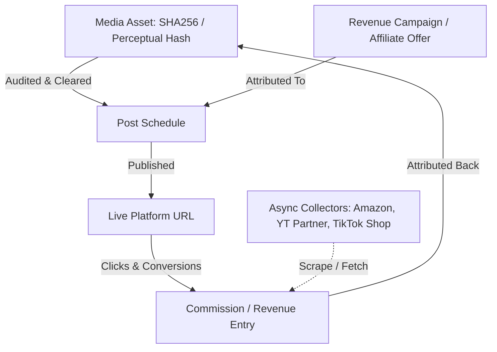

# HSE Creator Ops Dashboard: Revenue-First Architecture Review

**Date:** 2026-07-02  
**Author:** Antigravity (Architecture Challenger & Reviewer)  
**Status:** PROPOSED & READY FOR IMPLEMENTATION

---

## 1. Executive Summary & Challenge Context

This document challenges the traditional social-media scheduler architecture (epitomized by platforms like **Postiz**) and proposes a custom, lightweight, local-first **Creator Ops Dashboard** architecture for the **Hermes Social Engine (HSE)**.

### The Problem with Postiz (and general schedulers)
Postiz is a general-purpose scheduling tool designed for brand managers, agencies, and community building. For a **revenue-first solo-creator workflow**, it introduces significant friction:
1. **Vanity Metric Focus:** It tracks engagement (likes, retweets, comments) instead of direct conversion, affiliate commissions, or shop revenue.
2. **Infrastructure Bloat:** Running Postiz requires PostgreSQL, Redis, NestJS, Next.js, and a Temporal worker queue. For a single-user local automated setup, this stack is over-engineered, difficult to maintain, and resource-heavy.
3. **Hard API Dependencies:** It relies completely on approved developer API keys. If a platform is in review (like TikTok) or limits posting rate, Postiz fails to offer secondary fallback options.
4. **No Asset-Level Risk Auditing:** Postiz does not offer media duplicate prevention (perceptual hashing) or metadata leak scanning, exposing the user to platform shadowbans or project-name leaks.

### The HSE Advantage
HSE operates directly on local SQLite (`data/hse.sqlite3`), integrates natively with Python command-line media tools, and is controlled in a closed loop. We can build a dashboard that beats Postiz by focusing on:
- **Compliance & Leak Guards:** Intercepting internal terminology and media duplicates before they reach the API.
- **Attribution & Revenue Matching:** Linking specific affiliate products, links, and campaigns to SHA256 media assets.
- **Hybrid Publishing (Manual Basket):** Providing a high-efficiency staging UX for channels with API limitations.

---

## 2. The Core Philosophy: "Revenue-First" Creator Ops

A revenue-first architecture shifts the primary key of the system from the **Post** to the **Asset & Campaign**. 



### Key Differences
| Feature | Traditional Scheduler (Postiz) | HSE Creator Ops Dashboard |
| :--- | :--- | :--- |
| **Primary Unit** | A Scheduled Post (Calendar Slot) | An Audited Media Asset + Campaign Link |
| **Goal Metric** | Views, Shares, Retweets | Affiliate Earnings, RPC (Revenue per Clip) |
| **API Failure Mode**| Fails to post, displays red error | Falls back to **Manual Basket** companion page |
| **Media Safety** | None (Uploads any duplicate/flagged media) | SHA256 blocking + Perceptual media-audit checks |
| **Data Privacy** | SaaS/Cloud database or complex multi-container DB | Single local SQLite database (`data/hse.sqlite3`) |
| **Metadata Protection** | None | RegEx leak guards (no mentions of internal projects/AI) |

---

## 3. Technical Architecture Overview

To implement this vision, the HSE dashboard should be built as a local, lightweight Python web application (using **FastAPI** + **Uvicorn** + **Tailwind CSS/JS**) reading directly from HSE files and DB.

### 3.1 Extended SQLite Database Schema
To support revenue-first features, we will extend the existing `schema.sql` (defined in `src/hse/store.py`) with three tables:

```sql
-- Campaigns represent specific monetization targets (e.g., "TikTok Shop Hoodie Promo", "Amazon Associates Electronics")
CREATE TABLE IF NOT EXISTS campaigns (
    id INTEGER PRIMARY KEY AUTOINCREMENT,
    name TEXT NOT NULL,
    affiliate_url TEXT NOT NULL,
    platform TEXT NOT NULL,
    created_at TEXT NOT NULL
);

-- Associate posts with campaigns for click/revenue attribution
ALTER TABLE posts ADD COLUMN campaign_id INTEGER REFERENCES campaigns(id);
ALTER TABLE posts ADD COLUMN risk_score REAL DEFAULT 0.0;
ALTER TABLE posts ADD COLUMN audit_passed INTEGER DEFAULT 0;

-- Revenue records collected asynchronously from various platforms/affiliate panels
CREATE TABLE IF NOT EXISTS revenue_records (
    id INTEGER PRIMARY KEY AUTOINCREMENT,
    campaign_id INTEGER REFERENCES campaigns(id),
    post_id INTEGER REFERENCES posts(id),
    amount REAL NOT NULL,
    currency TEXT NOT NULL DEFAULT 'USD',
    source TEXT NOT NULL, -- 'tiktok_shop', 'amazon_associates', 'youtube_adsense'
    recorded_date TEXT NOT NULL,
    created_at TEXT NOT NULL
);
```

### 3.2 System Architecture Component Map

```mermaid
graph LR
    subgraph HSE Core (Python)
        DB[(data/hse.sqlite3)]
        CLI[hse CLI]
        Scheduler[HSE Scheduler]
    end

    subgraph Dashboard Server (FastAPI)
        API[Dashboard Backend API]
        Static[UI Static Server]
    end

    subgraph Revenue & Analytics Loop
        Worker[Async Revenue Worker]
        Scrapers[Amazon/TikTok/YT Collectors]
    end

    subgraph User Workspace
        UI[Local Web UI: Dark Command Center]
        Basket[Manual Staging Basket]
    end

    DB <--> API
    API <--> UI
    UI <--> Basket
    Scheduler --> DB
    CLI --> DB
    Worker --> DB
    Worker --> Scrapers
```

---

## 4. Key Architectural Subsystems

### 4.1 Asynchronous Revenue & Analytics Collectors
To capture revenue data without building massive platform integrations:
1. **API Integration (where available):** Pull YouTube Adsense revenue daily via Google Cloud API.
2. **Semi-Automated CSV Imports / Scrapers:** Built-in import system where the user drops TikTok Shop Affiliate CSV reports or Amazon Associates daily earnings reports into a folder (`data/imports/revenue/`). A background worker parses these and writes them to `revenue_records`.
3. **Attribution Engine:** Links earnings to posts using the tracking parameters in URLs (e.g., `?subID=post_{id}`) or by correlating the post's release date with traffic spikes.

### 4.2 Pre-Publish Compliance & Media Safety Pipeline
Before any media is queued or uploaded:
1. **Metadata Leak Guard:** The dashboard scans captions and descriptions for forbidden keywords defined in a local regex blacklist (e.g., `AI`, `Hermes`, `HSE`, `Money Printer`, `Workflow`, `Automation`). If found, it flags the post as blocked.
2. **Perceptual Media Audits:** Calculates and stores the perceptual hash (pHash) of all video files in `media` table. If the database detects a video with a pHash matching a previously published video within a critical similarity threshold (e.g. >92%), it alerts the user to prevent shadowbans for duplicate uploads.

### 4.3 Hybrid TikTok / Restricted API Staging (Manual Basket)
Since the TikTok app token is currently in review, and platform APIs frequently restrict direct public publishing, HSE will use a **Manual Basket workflow**:
- **Staging Mode:** Instead of attempting to upload directly, the job is marked with a special status `manual_staging`.
- **Basket Interface:** A clean mobile-friendly dashboard page listing staged posts.
- **Action flow:**
  1. The user clicks **Download Media** (downloads the audited video locally).
  2. The user clicks **Copy Caption** (copies the validated caption to clipboard).
  3. The user publishes manually via the TikTok mobile app or desktop browser.
  4. The user clicks **Mark Posted** in the dashboard and enters the resulting video URL to enable revenue tracking.

---

## 5. UI/UX Design System: "Dark Command Center"

The UI should feel premium, high-tech, and performance-driven, avoiding generic colors or basic Bootstrap-style themes.

### Style Palette (HSL Theme)
- **Background:** Deep Slate/Black (`hsl(220, 15%, 8%)`)
- **Card Background:** Dark Charcoal Glass (`hsl(220, 12%, 14%, 0.85)`)
- **Accent Purple (Brand):** `hsl(270, 75%, 60%)`
- **Success (Green):** `hsl(145, 65%, 45%)`
- **Warning (Orange):** `hsl(35, 75%, 50%)`
- **Alert/Danger (Red):** `hsl(0, 75%, 50%)`
- **Typography:** Inter or Outfit (Google Fonts)

### Core UI Views
1. **Platform Command Deck:** A set of cards displaying platform connection health (Token Valid, Expiring Soon, In Review, Inactive), OAuth scopes enabled, and quota usage.
2. **Revenue Attribution Board:** Real-time metrics showing total earnings, conversion rate, and a table showing **Revenue per Clip (RPC)** where videos are ranked by direct dollars earned.
3. **Safety Control Center:** Status flags showing SHA256 checks and Perceptual similarity reports. A visual warning indicator flashes if a video is too similar to an existing asset.
4. **Active Scheduler:** A timeline of planned posts, showing which are queued, which require manual staging, and failed posts waiting for manual intervention.

---

## 6. Actionable Implementation Plan

Here is the step-by-step technical roadmap to construct the dashboard.

### Phase 1: Local Dashboard Core (V1 MVP)
*Goal: Fast local server, read HSE DB, show platform readiness.*
- Initialize a FastAPI project in `src/hse/dashboard/`.
- Create a single-page HTML command center using Tailwind CSS.
- Map the backend to query `data/hse.sqlite3` for posts, events, and media tables.
- Render readiness cards for Telegram, YouTube, Facebook, and TikTok.

### Phase 2: Compliance & Risk Shield
*Goal: Prevent content duplication and leakage of internal terms.*
- Implement a regex-based metadata validator in `src/hse/media.py` to strip out AI/project keywords.
- Implement a perceptual hashing function (using `imagehash` or `phash` libraries) run on video thumbnails/frames.
- Add visual warning flags in the Dashboard UI if risk indicators exceed safe thresholds.

### Phase 3: Staging Basket (Manual Workflows)
*Goal: Solve TikTok upload friction without active API permissions.*
- Add a "Staging Basket" view to the UI.
- Implement endpoint `/api/basket/download/{post_id}` to download the media asset locally.
- Add UI click-to-copy mechanics for audited captions.
- Allow users to input the post URL manually and save it back to the database.

### Phase 4: Revenue Collectors & Attribution
*Goal: Automate ROI tracking.*
- Define the `campaigns` and `revenue_records` schemas in the database.
- Create a CLI command `hse import-revenue --source <name> <file_path>` to ingest affiliate CSV sheets.
- Add a revenue report screen to the UI displaying ROI, RPC, and overall performance.

---

## 7. Operational & Smoke Testing Guidelines

### Running the Dashboard Locally
Once the dashboard is coded, launch the server using `uv`:
```bash
uv run uvicorn hse.dashboard.main:app --reload --port 8000
```
Then visit `http://localhost:8000` to view the dark command center.

### Unit & Smoke Testing
Tests will be maintained in the `tests/` directory:
- **Database Test:** Ensure database connections to the sqlite file are non-blocking.
- **Mock Audit Test:** Write unit tests to check if the regex validator correctly triggers errors for keywords like `Money Printer` or `Hermes`.
- **Smoke API Test:** Test that `/api/status` returns correct platform readiness json payload.

---

> [!IMPORTANT]
> **Aesthetic Standard:** The UI must adhere to a premium, dark-mode design. Use rounded cards, CSS backdrop filters (`backdrop-blur`), and vibrant colored indicators. Placeholders for revenue columns must be built to support direct SQLite column integrations immediately.
